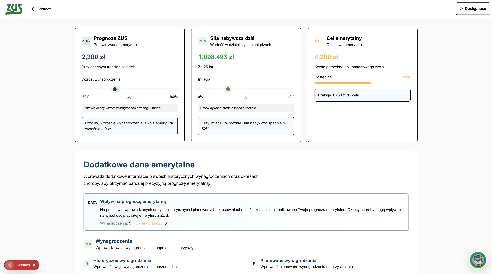
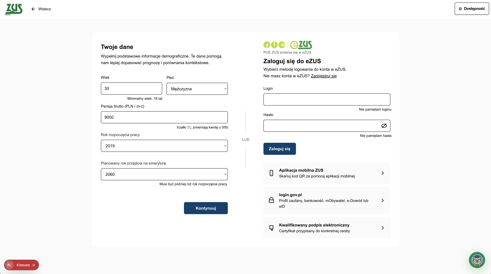
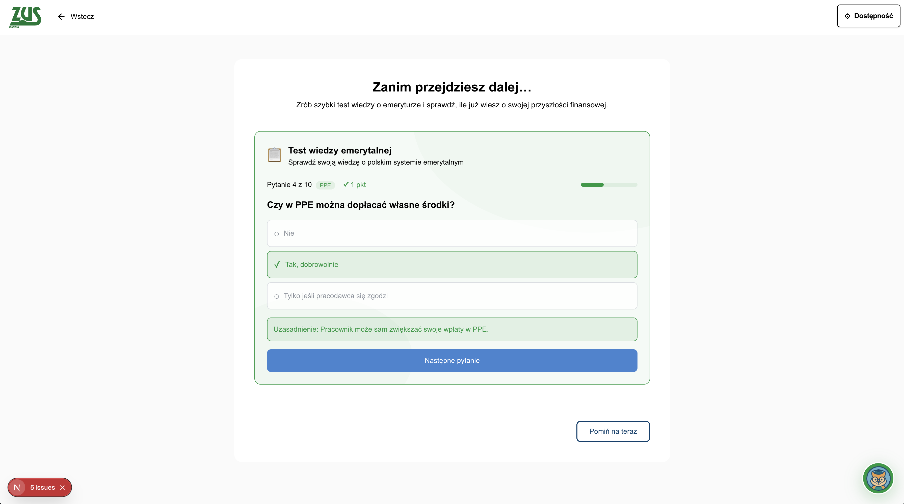
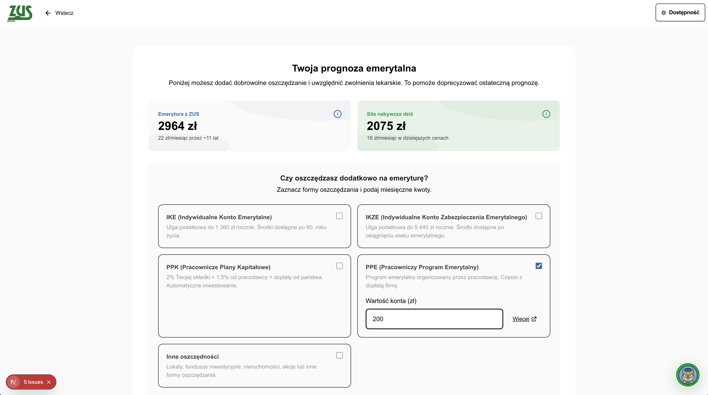
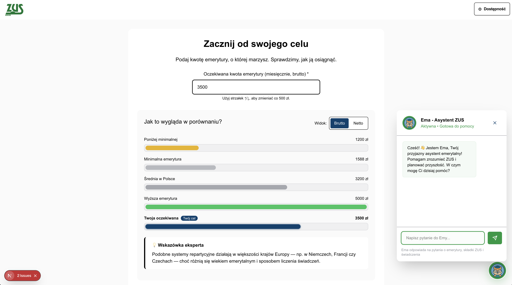

# HackYeah ZUS Assistant



Guided retirement planning experience for Polish ZUS participants. The project combines a Next.js onboarding flow, a Django calculation API backed by official datasets, and AI copilots that explain retirement forecasts in plain language.

## Highlights
- Eight step onboarding that captures expectations, demographics, sick leave history, and voluntary savings.
- AI copilot "Ema" that answers ZUS questions and explains forecasts using OpenAI chat endpoints.
- Django API that reads official CSV datasets (`backend/dane.csv`, `backend/zwolnienia.csv`) to estimate pension capital, real purchasing power, and sick leave impact.
- Data visualizations, printable reports, and knowledge quizzes that keep users engaged beyond the initial forecast.
- Optional RAG bot that crawls zus.pl pages, builds a BM25 index, and answers niche policy questions with cited sources.

## Product tour
### Guided onboarding

Lead users through demographics, work history, and expectations with guard rails that keep the flow in sync.

### Knowledge checks

Interactive quizzes reinforce retirement concepts and clarify what still needs to be collected.

### Forecast insights

Result pages blend hard numbers with AI generated conclusions, explain inflation adjusted values, and export to PDF.

### Always on assistant

The Ema widget stays docked on every page and replies in seconds using the `/api/chat` OpenAI endpoint.

### Post onboarding dashboard

Personal dashboard tracks gaps toward the retirement goal, visualizes scenarios, and surfaces quiz follow ups.

## Architecture
```
Next.js 15 App Router (frontend/src)
    |  └─ Client + server components, Jotai store, Tailwind 4 design system
    |          |\
    |          | \__ /api/chat → OpenAI (chat guidance)
    |          |__ /api/retirement-analysis → OpenAI (3 actionable insights)
    v
Django REST endpoints (backend/django_project/calc)
    ├─ /api/calc/signup (JSON POST)
    ├─ /api/calc/pension (JSON POST)
    └─ /api/calc/fact (GET)
        |
        └─ backend/calc2.py → dane.csv, zwolnienia.csv for indexation, life expectancy, sick leave tables

Optional: backend/zus-bot/rag_zus_bot.py → crawls zus.pl, builds BM25 index, answers policy questions via OpenAI
```

## Getting started
### 1. Backend API (Django)
```bash
cd backend
python -m venv .venv
source .venv/bin/activate
pip install -r requirements.txt
cp django_project/.env.example django_project/.env  # create if you need custom secrets
python django_project/manage.py migrate
python django_project/manage.py runserver 0.0.0.0:8000
```
- Default settings enable CORS, so the Next.js app can talk to the API locally.
- Expose `DJANGO_SECRET_KEY`, `DJANGO_DEBUG`, and `DJANGO_ALLOWED_HOSTS` in `backend/django_project/.env` when deploying.

### 2. Frontend (Next.js + Tailwind)
```bash
cd frontend
npm install
# touch .env.local  # create if it does not exist
# OPENAI_API_KEY=sk-...
# NEXT_PUBLIC_BACKEND_URL=http://localhost:8000/api/calc  # optional helper if you refactor fetch URLs
npm run dev
```
- The Jotai store currently posts to `http://20.86.144.2:8000/api/calc/...`. Point the fetch helpers in `src/lib/store/hooks.ts` to your backend (for example by reading `process.env.NEXT_PUBLIC_BACKEND_URL`).
- `npm run build` runs Next.js with Turbopack and generates sitemap files.

### 3. RAG bot (optional knowledge base)
```bash
cd backend/zus-bot
python -m venv .venv
source .venv/bin/activate
pip install -r requirements.txt
export OPENAI_API_KEY=sk-...
python rag_zus_bot.py --scrape    # crawl zus.pl knowledge base
python rag_zus_bot.py --build     # build BM25 index with bm25s
python rag_zus_bot.py --chat      # interactive CLI with cited answers
```
- The crawler stores raw pages under `backend/zus-bot/data/` and a reusable index under `backend/zus-bot/index/`.
- Adjust `SEED_URLS` or `CRAWL_MAX_PAGES` inside `rag_zus_bot.py` to widen or shorten the crawl.

## Project structure
```
.
├── backend/
│   ├── calc2.py             # Pension math backed by CSV datasets
│   ├── dane.csv / zwolnienia.csv
│   ├── requirements.txt
│   └── django_project/
│       ├── calc/             # API views and urls
│       └── core/             # Settings, ASGI/WSGI, database
├── frontend/
│   ├── src/app/             # App Router pages (+ API routes)
│   ├── src/components/      # ZUS design system, dashboard widgets, chat drawer
│   ├── src/lib/store/       # Jotai atoms, hooks, flow management
│   └── package.json         # Next.js scripts and dependencies
└── .readme-assets/          # Screenshots used in this document
```

## Useful commands
- `npm run lint` (frontend) runs ESLint across the TypeScript codebase.
- `python django_project/manage.py createsuperuser` to explore Django admin with seeded data.
- `python rag_zus_bot.py --ask "Jak dziala waloryzacja?"` returns a cited answer from the indexed corpus.

## Deployment notes
- Host the Django API (e.g., Azure App Service, Railway) and expose HTTPS endpoints consumed by the Next.js frontend.
- Remember to configure `OPENAI_API_KEY` for both Next.js edge functions and the optional RAG bot.
- Store CSV datasets alongside the backend binaries or switch to a managed database once production ready.
